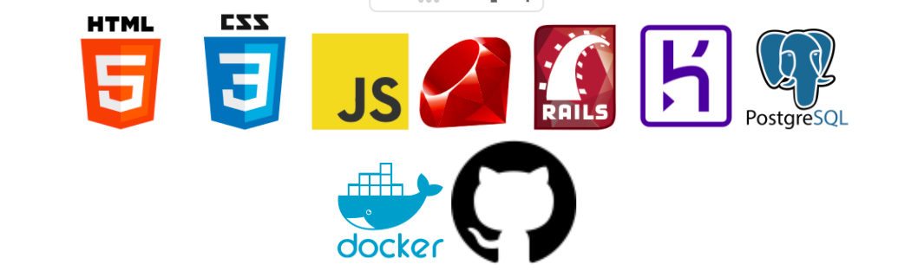

# 走りのためのアプリ　「runboost」

# アプリURL
https://runboost.herokuapp.com/
# 対象ユーザ
#### ランニングを趣味とする全ての人
# 実装機能
- **走りの記録**
- **走りの目標設定**
- **走りの達成度の確認**

上記の機能により走りの見える化を実現し、ランナーの走りをサポートします。
# 機能詳細
### 一目でわかる「あなたの走り」

- 「今月の距離」「年間走行距離」などをトップページで速やかに確認できます。
- カレンダーを見れば速やかにあなたの走りのログを確認できます。

  - 「今月の距離」「年間走行距離」などをトップページで速やかに確認できます。
  - カレンダーを見れば速やかにあなたの走りのログを確認できます。

### グラフで「見える化」
- グラフであなたの「達成度」が確認できます。これにより、達成度のグラフ化によりあなたのモチベーションに火をつけます。

### 吹き出しで促される「目標設定」
- 目標を設定していない場合は、設定するように促す吹き出しが出現します。もう、目標を設定せざるを得ません。

### 快適に遡れる「過去ログ」
- 過去のログを非同期でのページネーションで快適に確認できます。

# 使用技術
### バックエンド
- Ruby 2.7.5
- Rails 5.2.6
- RSpec 4.1 

### フロントエンド
- HTML
- SCSS
- JavaScript
- Bootstrap

### インフラ
- heroku
- AWS（S3）
### CI
- GitHub Actions
### データベース
- PostgreSQL
### 仮想環境（開発環境のみ）
- Docker

# ER図

